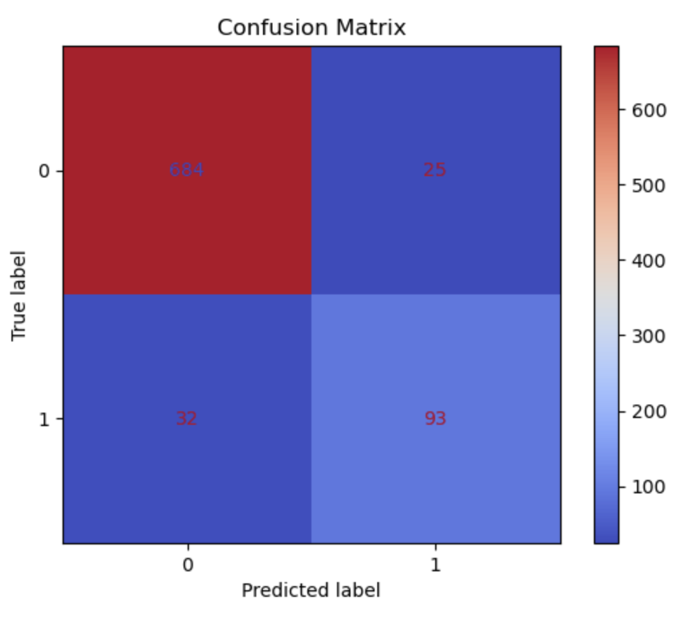
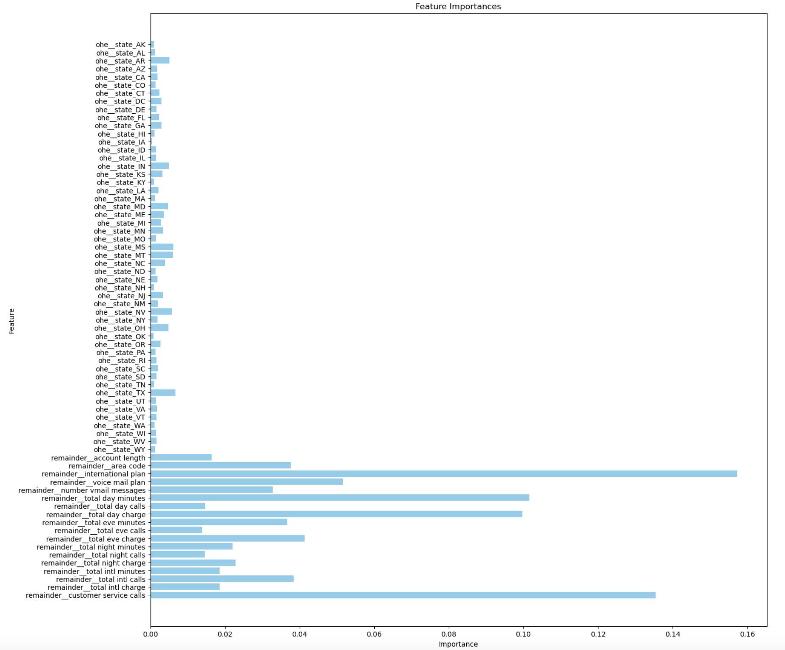

# Telecommunications Customer Behavior Analysis
Author: Adam Pell

# Overview
This project will use different classifiers to analyze and predict customer churn for a telecommunications company.

Iterative analysis of multiple features creates a better understanding of which factors contribute to a customer switching providers. My firm, Pell & Associates Data Solutions, has developed a classifier model that is capable of predicting with up to 93% accuracy whether a customer will switch providers or not. Being able to accurately forecast churn and knowing its key predictors is vital for any telecommunications business, as it allows them to stay ahead of customer needs and expand their services with a clear perspective on risk.

# Business Understanding
Telecommunications companies provide some of the most valuable services in the world to their customers allowing people to communicate across states, borders, and continents. The market is valued at over 1.7 trillion dollars globally. Telecoms companies are in a unique position because, to the average consumer, the level of service between most of these companies is identical. Moreover, there is an abundance of choice; many reputable companies exist in most countries. Since most people cannot go without a service provider, they may be more likely to switch to another provider if they perceive a problem with their current one. For service providers in America and abroad, it is important to foresee the risk of customers switching providers, as unexpected departures can lead to a drop in revenues and a lack of clarity regarding how to stem the tide.

Pell & Associates Data Solutions is here to help provide that clarity. This project will examine over 3300 customer records from across America, modeling trends and building predictive classifiers that are able to accurately assess whether future customers are at risk of leaving.

# Data Understanding
The available data comes from a telecom compoany's record of customer information. Our target for this analysis will be the "churn" column. In this case, churn is a metric that reports whether a customer switched providers or not. For this project, the "negative case" will be 0, indicating that the customer did not "churn", or switch. The positive case will be 1, meaning that the customer did switch. My analysis will examine features that are likely to play a role in customer churn. They include:

- State
- Account Length (in months)
- Area Code
- International Plan (y/n)
- Voice Mail Plan (y/n)
- No. of Voicemail Messages
- Total Day Minutes, Calls, and Charges
- Total Evening Minutes, Calls, and Charges
- Total Night Minutes, Calls, and Charges
- Total International Minutes, Calls, and Charges
- No. of Customer Service Calls

I have included the above features because they all stand to have a connection to customer churn. I have excluded features such as "phone number" because that is unlikely to have any correlation to a customer's decision to switch providers.

### Limitations
The dataset I am working with is relatively small, only containing 3333 rows of information. There is also no description of the dataset included from the source, so the data lacks context such as when these records are from.

These limitations may make it more difficult for my model to generalize to updated or more modern data.

# Methods
This analysis uses various classifier techniques. We start with linear regression, move on to a decision tree, and finish with a random forest that we then fine-tune to improve performance on target metrics.

# Results
Our final model was a tuned version of the random forest method we ran as part of the base modeling process. The tuning process consisted of changes iterated over several sets of hyperparameter categories. GridSearchCV ran these iterations, finding the specific set of hyperparameters that led to optimal performance for a given scoring metric. I optimized for recall since that is the most important metric for stakeholders in this particular case and because it seems we are already achieving an excellent accuracy score.

The final product saw incremental improvements in already-solid performance almost all the way across the board. We saw marginal increases in our accuracy score, as well as improved recall for the positive case, which is what we were chasing and optimizing for. Precision and recall for the negative case remained stellar.

Another notable improvement is that we managed to somewhat stem the overfitting issue we had with both our decision tree and our base random forest model. With our base model, we had a perfect score on the training data. Our accuracy on the test data was 93%. With the tuned model, we have reduced our performance on the training data to around 98%. With the same accuracy score, we have reduced the error between the training and test set. This indicates that our model has become less overfit to the training data and can still generalize just as well. Although I wish I could have improved recall a bit more, I am very pleased with this outcome.

**Image: Map of Churn Rates by State**

**Image: Confusion Matrix of Fine-Tuned Model**

**Image: Chart of Feature Importances**

## Feature Importances
The two standout features are the possession of an international plan and the number of customer service calls made. This shouldn't be surprising if we look back at our correlation heatmap, as those features were the most correlated with churn. We can also see that total day minutes and charges play a large role in determining churn. We take a fairly steep drop below that, with voice mail plan contributing a little along with evening and international call charges.

The feature importances for states don't always mimic the churn rate map we plotted at the beginning of the project. If we look closely, we can see that some high-rate states like Texas have a proportionally larger importance, but we also see lower-rate staes like Arizona and Nevada having higher importance than their churn rate would suggest.

# Conclusions
Our iterative modeling process has yielded a final classifier that is effective at predicting customer churn. With an accuracy score of 93%, we know that our predictions will be pretty reliable. We also have achieved excellent recall on the negative case. While the recall for the positive case is lagging behind, our model has proven that the class bias can be improved with fine-tuning. Based on this model, its feature importances, and predictions, our recommendations would be:

- #### Flag customers with accounts that match key features:
    - Above-average number of customer service calls
    - High international minutes
    - High day minutes
    
- #### Offer special promotions to flagged accounts, especially ones with multiple customer service calls or high international minutes

- #### Consider changing day rates for high-churn states

The core strategy of these recommendations uses our model to identify accounts that are at a high risk for churn. These customers could be ones who have made an above-average number of customer service calls, or simply ones who are paying high bills for day or international usage. Once those accounts are identified, high-risk customers can be targeted with special rate packages, free minutes, upgrades, or other promotions that make continued loyalty more attractive than switching plans. Timely identification of high-risk accounts using the patterns identified by our model should open the door for a significant increase in customer retention and satisfaction.

## Next Steps
While our model is performing well, it could be improved. First and foremost, another step would be to expand the dataset. More features and more rows of customer information would likely improve performance even further, since we were able to achieve 93% accuracy with only around 3300 rows of data. Further analysis could include:

- In-depth geographical breakdowns of churn
- Time-of-year analysis
- Content analysis of customer service calls

## Repository Structure
- data
    - customer_churn_data.csv
- Phase 3 Project.ipynb
- Phase_3_Project_Presentation(link)
- images
    - confusion_matrix_screenshot.png
    - feature_importances_screenshot.png
- .gitignore
- README.md

## Contact Information
- Email: apell7591@gmail.com
- Phone: 917-434-6615
- GitHub: [apell7594](https://github.com/apell74)
- LinkedIn: [Adam Pell](www.linkedin.com/in/adam-pell-911868154)
